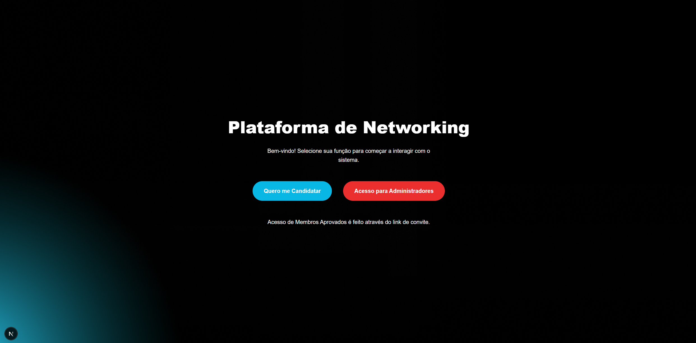

# Plataforma de Networking - Frontend

Este projeto implementa o Front-end para a Plataforma de Gestão de Networking, desenvolvida em **Next.js (App Router)** e **React**, utilizando **Tailwind CSS** para estilização. O foco é na modularidade, tipagem e na garantia de que o fluxo de admissão de membros seja claro e seguro.

## 🌟 Arquitetura e Destaques Técnicos

- **Stack:** Next.js 14, React 19, TypeScript.
- **Estilização:** Tailwind CSS, configurado com **CSS Variables Customizadas**, permitindo fácil manutenção de temas e cores (`bg-primary`, `text-danger`, etc.).
- **Componentização:** Utilização do `InputField.tsx` como componente reutilizável, garantindo a semântica HTML e a consistência visual em todo o projeto.
- **Segurança:** O Front-end gerencia a chave de administrador (`x-api-key`) via `useAdminAuth` e `localStorage` para proteger o acesso às rotas administrativas.
- **Testes:** Cobertura de Testes de Integração de Componentes (RTL) no formulário de candidatura, simulando a comunicação da UI com a API.

## 🛠️ Instalação e Execução

### 1\. Inicialização do Backend (Obrigatório)

O Front-end depende da API para funcionar. Certifique-se de que o projeto de Backend (NestJS) esteja instalado, configurado (com o banco de dados e o `.env`) e rodando primeiro.

### 2\. Configuração de Variáveis de Ambiente

Crie um arquivo `.env.local` na raiz do projeto Front-end e defina a URL base da sua API:

```bash
# .env.local
NEXT_PUBLIC_API_BASE_URL="http://localhost:3001" # Mantenha a porta configurada no seu Backend
```

### 3\. Instalação e Execução do Front-end

Instale as dependências e inicie o servidor de desenvolvimento:

```bash
pnpm install
pnpm run dev
```

> ⚠️ **ATENÇÃO:** O servidor de desenvolvimento padrão é `http://localhost:3000`. Se essa porta estiver em uso, o Next.js utilizará a próxima porta livre. **Verifique o terminal** para acessar a URL correta.

---

## 🎯 Fluxo de Admissão de Membros (Passo a Passo)

O fluxo implementado e testado demonstra a jornada completa do candidato à membro ativo:

### Passo A: Candidatura (Público)

1.  Acesse a URL principal (ex: `http://localhost:3000`).
2.  Clique em **"Quero me Candidatar"** (`/candidatar`).
3.  Preencha o formulário e clique em **"Enviar Candidatura"**.
    - **Resultado:** A candidatura é criada no Backend com status **PENDENTE**.

### Passo B: Aprovação pelo Administrador (Painel Protegido)

1.  Acesse **Acesso para Administradores** (`/admin`) e faça login com a chave secreta.
2.  **Token de Login:** A chave é o `ADMIN_SECRET` configurado no `.env` do Backend.
3.  Você será redirecionado para a lista de intenções (`/admin/intencoes`).
4.  **Aprovação:** Clique em **"APROVAR"** na candidatura criada.
    - **Ação Crítica:** O Backend gera um **Token Único** e o **logará no terminal do NestJS** (simulando o envio de e-mail). **Copie este Token\!**

### Passo C: Cadastro Final (Uso do Token de Convite)

1.  **Acesse a URL Dinâmica:** No navegador, digite o endereço de cadastro final, substituindo o token:
    ```
    http://localhost:3000/cadastro/[COLE-AQUI-O-TOKEN-GERADO]
    ```
2.  **Finalização:** A página carregará os dados pré-aprovados (`Nome`, `Email`, `Empresa`) e pedirá as informações faltantes (`Telefone`, `Cargo`).
3.  Clique em **"Concluir Cadastro"**.
    - **Resultado:** O registro de **Membro** é criado como ativo, o token é marcado como usado, e o usuário é redirecionado para a página de sucesso.

---

## 🧪 Como Rodar os Testes de Front-end

Os testes de integração de componente usam **Jest** e **React Testing Library** (RTL).

```bash
pnpm run test
```

- **Validação:** Este comando garante que o formulário de candidatura se comporta corretamente (preenchimento, chamada de API e exibição de mensagens de sucesso/erro) sem a necessidade de um navegador.
